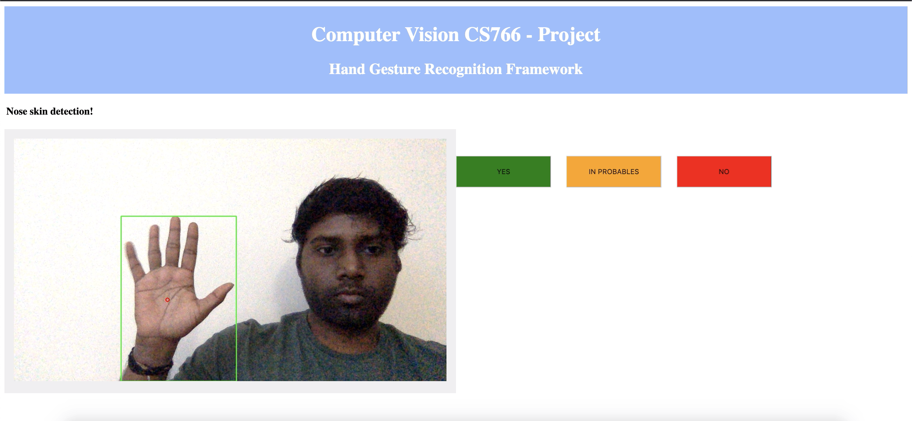
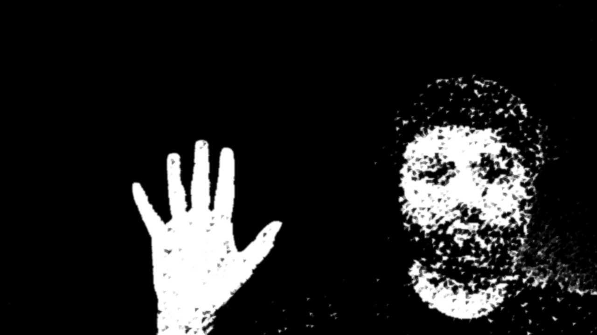
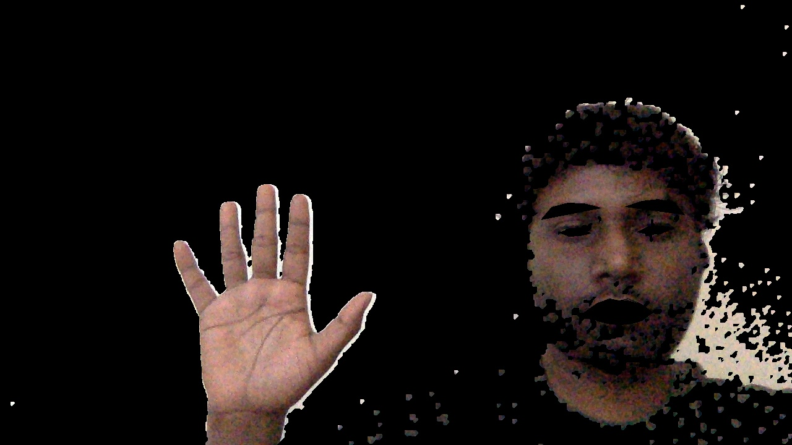
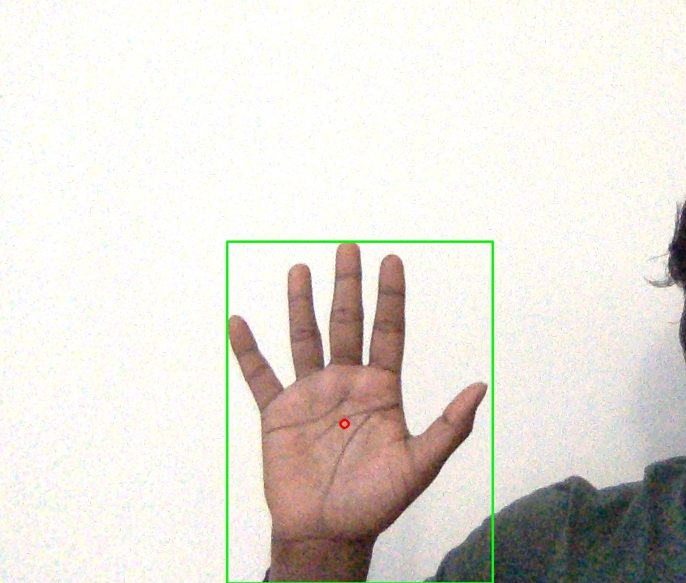
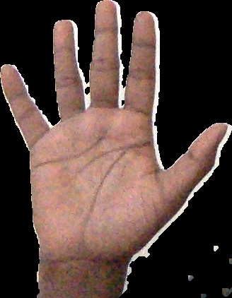
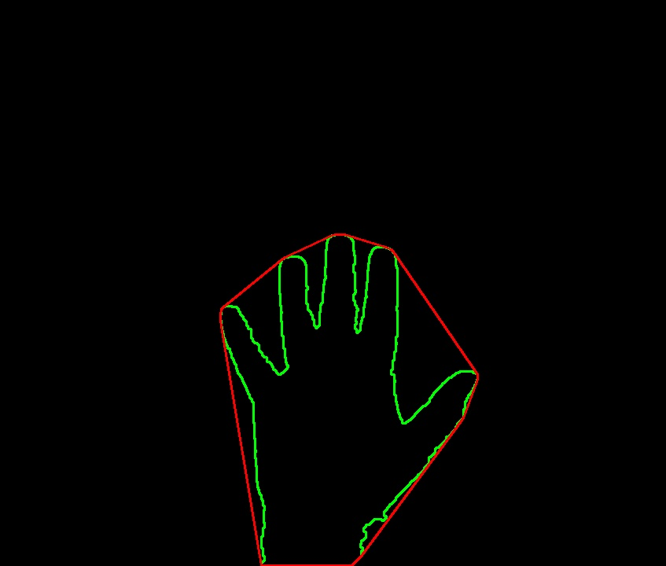
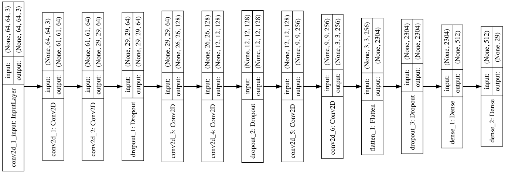

## Table of Content
1. [Introduction](#introduction)
2. [Framework](#framework)
3. [Hand Segmentation](#hand-segmentation)
4. [CNN Model](#cnn-model)
5. [Results](#results)
6. [Conclusion and future work](#conclusion-and-future-work)
7. [References](#references)

### Introduction

Gesture recognition is an active research field that tries to integrate the gestural channel in Human-Computer interaction. It has a variety of applications like virtual environment control, sign language translation, robot remote control, musical creation, etc. Several applications have been built around human gestures, wherein the detected gesture triggers a command or serves as an input to the system. It has proven to be useful and enhance user experience in many scenarios.

A configurable framework for gesture recognition can let application developers easily incorporate gesture controls onto their system by mapping gestures to their corresponding actions depending upon their implementation logic. Applications can support sophisticated user interfaces with significantly less effort. Since the existing approaches require external equipment like gloves or fixed background to detect the hand, it makes the task of integrating with other applications difficult. We could utilize the recent advancements in Computer Vision and Artificial Intelligence to build a framework that detects gestures using only the raw input feed from the camera which would be a promising tool for application development.

### Related Work

Many image processing based approaches involve conventional image filters to extract spacio-temporal features and build Hidden Markov Models for hand gesture recognition by considering it as a motion detection problem. In [TODO: add reference link], the system obtains shape and optical flow based features to build a HMM to recognize twelve different type of gestures. In traditional Machine Learning based approaches which use techniques like Support Vector Machines, Artificial Neural Networks, Fuzzy c-means clustering, etc. feature engineering plays a crucial role in prediction accuracy. The gesture recognition system in [TODO: add reference link], eliminates hand segmentation by clipping the hand region manually. It used hand images with uniform light background for the Fuzzy c-means clustering. In [TODO: add reference link], Bheda and Radpour built a CNN based gesture recognition system which resulted a 82.5% validation accuracy.

### Our Framework

Our goal of the project is to build a prototype for the described gesture recognition framework. The raw input feed from the camera is split into frames. For every few frames where the change in the scene is minimal, one among them is taken as a reference for the gesture. The position of hand which is the region of interest in the frame is then extracted and pre-processed. It is then passed on to the CNN model to predict the observed gesture.

Convolutional Neural Network is a deep learning technique whereby several convolutions and pooling layers are stacked to perform operations like transformation, feature extraction, and decision making. It is the state of the art algorithm for object recognition. The American Sign Language has 26 different gestures which are the symbols for each English alphabet. A dataset [TODO: add reference link] consisting of images depicting gestures for each of these 26 types could be used to build a CNN model that classifies a given gesture into one among these. This model serves as the backbone of our framework.

### Hand Segmentation

Hand segmentation can be done using several approaches like motion-based, skin-based or with object detection techniques. Each technique has its advantages in terms of complexity and accuracy. Most systems use glove based methods for easier feature extraction leading to better accuracy. Very few approaches have been proposed in terms of RGB for hand detection.

### Static

As you can see, there are a lot of challenges in detecting the hand from the input frame. Hence, we first experimented with the idea of neglecting the background by fixing a rectangular boundary for the region of interest (ROI) and expect the hand to be present within the boundary. Now, the focus in this approach is to effectively pre-process the ROI to extract features in a format that could be input to the model. 

The steps involved are discussed below.
<li>OpenCV continuously gets input frames from the system camera.</li>
<li>The input frame is tranformed from RGB to YCbCr color space. </li>
<li>From the input frame, we crop out the ROI and convert it into a binary image and apply Gaussian filter.</li>
<li>The first ROI frame is saved as a reference for the background and in the next 25 frames, we accumulate the weights and update the background.</li>
<li>Once the background is fixed, perform morphological transformations like dilation, erosion and median filter to sieve the background noise and preserve structural integrity.</li>
<li>Threshold the image to get the foreground. The maximum contour area gives the segmented hand which could be sent to the model for gesture prediction.</li>

### Dynamic

In this approach also, the RGB image frame is converted to YCbCr color space. Using facial landmark detection, colour of the skin pixels are dynamically determined. All the skin coloured pixels are figured out by thresholding the color value with acceptable offsets and then filtering it out. We then binarize the resultant image and apply the same set of morphological operations as described in the previous method. Now we have a processed image denoting the contour of all the skin coloured pixels in the frame.

We know that for a given set of points, the convex hull algorithm gives the smallest convex polygon that contains all the points within it. Therefore, we can use this algorithm to identify the smallest convex polygon that surrounds the hand region thereby isolating the hand from the rest of the frame.

<figure>
  	
  	<figcaption align="center">Fig1. Input image frame captured from System</figcaption>
</figure>
<figure>
  	
  	<figcaption align="center">Fig2. Masked image for Skin detection</figcaption>
</figure>
<figure>
  	
  	<figcaption align="center">Fig3. Filter image for skin tone</figcaption>
</figure>
<figure>
  	
  	<figcaption align="center">Fig4. Cropped hand segment region</figcaption>
</figure>
<figure>
  	
  	<figcaption align="center">Fig5. Hand region extracted from masking</figcaption>
</figure>
<figure>
  	
  	<figcaption align="center">Fig6. Convex hull applied to hand region</figcaption>
</figure>

### CNN Model

The model we are using currently is a Convolution neural net with the architecture as shown below:

  

### Results

We have integrated our prototype with VLC Media Player which stimulates a key press upon predicting a gesture which in turn triggers a corresponding action.

### Conclusion and future work

We were successful on building a framework for gesture recognition that works on raw RGB images without using any special equipment.  
Gestures that require spatio-temporal features for classification could not be determined with just 2D image frames. Current advancements in Computer Vision which uses depth sensors to extract depth information of an image might help us in recognizing such gestures.   
Also for cases where the background color is close to the skin color of ROI, the hand segmentation is not so effective. Techniques to overcome this problem would significantly broaden the application of our system.   
Memory based learning algorithms like RNN, LSTM could be used to extend the range of supportable gestures by also considering those which involve object movement between frames into account.

### References

<ol>
<li>https://www.sciencedirect.com/topics/computer-science/gesture-recognition</li>
<li>https://www.kaggle.com/grassknoted/asl-alphabet</li>
<li>https://medium.com/@ksusorokina/image-classification-with-convolutional-neural-networks-496815db12a8</li>
<li>https://www.ripublication.com/ijaer18/ijaerv13n9_90.pdf</li>
<li>http://cs231n.stanford.edu/reports/2016/pdfs/214_Report.pdf</li>
<li>"A gesture based interface for remote robot control" by Ashutosh, A. Singh, S. Banerjee, and S. Chaudhury. https://ieeexplore.ieee.org/document/797102</li>
<li>"Sign language finger alphabet recognition from gabor-pca representation of hand gestures" by M. A. Amin and H. Yan. https://ieeexplore.ieee.org/document/4370514</li>
<li>"Using deep convolutional networks for gesture recognition in american sign language" by Vivek Bheda and Dianna Radpour. https://arxiv.org/abs/1710.06836</li>
</ol>

