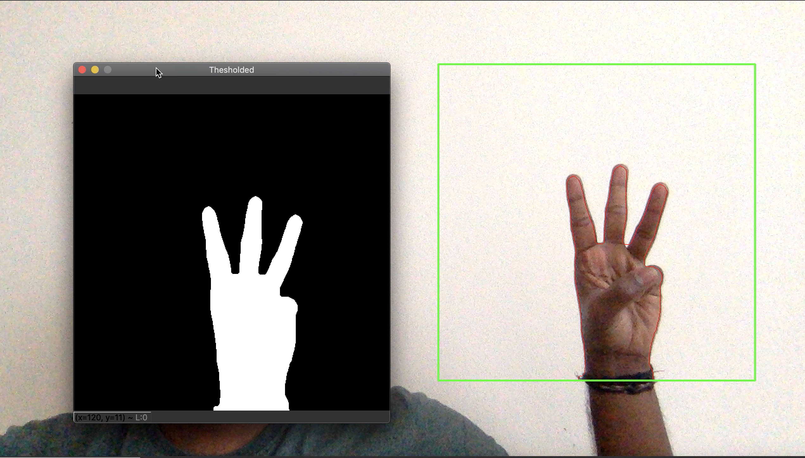

## Table of Content
1. [Introduction](#introduction)
2. [Related Work](#related-work)
3. [Framework](#framework)
4. [Hand Segmentation](#hand-segmentation)
	1. [Static](#static)
	2. [Dynamic](#dynamic)
5. [CNN Model](#cnn-model)
6. [Results](#results)
7. [Challenges](#challenges)
8. [Conclusion and future work](#conclusion-and-future-work)
9. [References](#references)

### Introduction

Gesture recognition is an active research field that tries to integrate the gestural channel in Human-Computer interaction. It has a variety of applications like virtual environment control, sign language translation, robot remote control, musical creation, etc. Several applications have been built around human gestures, wherein the detected gesture triggers a command or serves as an input to the system. It has proven to be useful and enhance user experience in many scenarios.

A configurable framework for gesture recognition can let application developers easily incorporate gesture controls onto their system by mapping gestures to their corresponding actions depending upon their implementation logic. Applications can support sophisticated user interfaces with significantly less effort. Since the existing approaches require external equipment like gloves or fixed background to detect the hand, it makes the task of integrating with other applications difficult. We could utilize the recent advancements in Computer Vision and Artificial Intelligence to build a framework that detects gestures using only the raw input feed from the camera which would be a promising tool for application development.

### Related Work
Many image processing based approaches involve conventional image filters to extract spacio-temporal features and build Hidden Markov Models for hand gesture recognition by considering it as a motion detection problem. In [[6](#references)], the system obtains shape and optical flow based features to build a HMM to recognize twelve different type of gestures. In traditional Machine Learning based approaches which use techniques like Support Vector Machines, Artificial Neural Networks, Fuzzy c-means clustering, etc. feature engineering plays a crucial role in prediction accuracy. The gesture recognition system in [[7](#references)], eliminates hand segmentation by clipping the hand region manually. It used hand images with uniform light background for the Fuzzy c-means clustering. In [[8](#references)], Bheda and Radpour built a CNN based gesture recognition system which resulted a 82.5% validation accuracy.

### Framework

Our goal of the project is to build a prototype for the described gesture recognition framework. The raw input feed from the camera is split into frames. For every few frames where the change in the scene is minimal, one among them is taken as a reference for the gesture. The position of hand which is the region of interest in the frame is then extracted and pre-processed. It is then passed on to the CNN model to predict the observed gesture. We are testing out our framework with gestures from Amercan Sign Language(ASL). Following are the alphabets in ASL. In the below sections we have tried to mimic these gestures.
<figure>
    
    <figcaption align="center">ASL alphabets</figcaption>
</figure>

Convolutional Neural Network is a deep learning technique whereby several convolutions and pooling layers are stacked to perform operations like transformation, feature extraction, and decision making. It is the state of the art algorithm for object recognition. The American Sign Language has 26 different gestures which are the symbols for each English alphabet. A dataset [[2](#references)] consisting of images depicting gestures for each of these 26 types could be used to build a CNN model that classifies a given gesture into one among these. This model serves as the backbone of our framework.

### Hand Segmentation

Hand segmentation can be done using several approaches like motion-based, skin-based or with object detection techniques. Each technique has its advantages in terms of complexity and accuracy. Most systems use glove based methods for easier feature extraction leading to better accuracy. Very few approaches have been proposed in terms of RGB for hand detection.

### Static

As you can see, there are a lot of challenges in detecting the hand from the input frame. Hence, we first experimented with the idea of neglecting the background by fixing a rectangular boundary for the region of interest (ROI) and expect the hand to be present within the boundary. Now, the focus in this approach is to effectively pre-process the ROI to extract features in a format that could be input to the model. 

The steps involved are discussed below.
<li>OpenCV continuously gets input frames from the system camera.</li>
<li>The input frame is tranformed from RGB to YCbCr color space. </li>
<li>From the input frame, we crop out the ROI and convert it into a binary image and apply Gaussian filter.</li>
<li>The first ROI frame is saved as a reference for the background and in the next 25 frames, we accumulate the weights and update the background.</li>
<li>Once the background is fixed, perform morphological transformations like dilation, erosion and median filter to sieve the background noise and preserve structural integrity.</li>
<li>Threshold the image to get the foreground. The maximum contour area gives the segmented hand which could be sent to the model for gesture prediction.</li>

<figure>
  	
  	<figcaption align="center">Fig1. Input image captured and green rect refers to the region where background is fixed</figcaption>
</figure>
<figure>
  	
  	<figcaption align="center">Fig2. Raw image where gestures captured in ROI</figcaption>
</figure>
<figure>
  	
  	<figcaption align="center">Fig3. Threshold image for various gestures</figcaption>
</figure>

### Dynamic

In this approach also, the RGB image frame is converted to YCbCr color space. Using facial landmark detection, colour of the skin pixels are dynamically determined. All the skin coloured pixels are figured out by thresholding the color value with acceptable offsets and then filtering it out. We then binarize the resultant image and apply the same set of morphological operations as described in the previous method. Now we have a processed image denoting the contour of all the skin coloured pixels in the frame.

We know that for a given set of points, the convex hull algorithm gives the smallest convex polygon that contains all the points within it. Therefore, we used this algorithm to identify the smallest convex polygon that surrounds the hand region thereby isolating the hand from the rest of the frame.

<figure>
  	
  	<figcaption align="center">Fig1. Input image frame captured from System</figcaption>
</figure>
<figure>
  	
  	<figcaption align="center">Fig2. Masked image for Skin detection</figcaption>
</figure>
<figure>
  	
  	<figcaption align="center">Fig3. Filter image for skin tone</figcaption>
</figure>
<figure>
  	
  	<figcaption align="center">Fig4. Cropped hand segment region</figcaption>
</figure>
<figure>
  	
  	<figcaption align="center">Fig5. Hand region extracted from masking</figcaption>
</figure>
<figure>
  	
  	<figcaption align="center">Fig6. Convex hull applied to hand region</figcaption>
</figure>

### CNN Model
### Introduction

Deep learning is an artificial intelligence function that imitates the workings of the human brain in processing data and creating patterns for use in decision making. Deep learning is a subset of machine learning in artificial intelligence (AI) that has networks capable of learning unsupervised from data that is unstructured or unlabeled. The convolutional neural network (CNN) is a class of deep learning neural networks. CNNs represent a huge breakthrough in image recognition. They’re most commonly used to analyze visual imagery and are frequently working behind the scenes in image classification. The main reason behind this is because in CNN is feature engineering not required. Before CNN, people spent a lot of time on feature selection(algorithm for features extraction). When compared with these handcrafted features with CNN, CNN as well or even better in terms of accuracy. That is because it learns different features from images.

### Static

The model we are using currently is built from scratch and we have integrated this model with the static processing of images to improve the accuracy of the model. When the image is preprocessed the background is removed which leads to better training of the model. The CNN used has the following architecture:

  

The training data set contains 87,000 images which are 200x200 pixels. There are 29 classes, of which 26 are for the letters A-Z and 3 classes for Space, Delete and nothing. These 3 classes are very helpful in real-time applications and classification. The test data set contains a mere 29 images. We took more images personally to add to this dataset.
The train and test data mainly consists of real-world images like the following :

  

The model is trained for 5 epochs. Using GPU the training time is roughly around 180-200s for each of the epoch. The final training accuracy of the model is 0.9647 and the final validation accuracy is 0.8948. Testing using real world images only leads to an accuracy of 41.15%. One of the main problem that we faced earlier was that the images weren't preprocessed. Once it was preprocessed the accuracy was 51.23%.

In case of static we built the model from scratch, trained the model with a dataset and then used that model to predict the sign in the images. But the downside to this approach was the training time. It took around 20 mins for 5 epochs with a GPU. It is hard to find resources like GPU as well and we needed to retrain after every minor change in the code.This is where transfer learning came into picture. Transfer Learning is a method of transferring the hyperparameters of pretrained networks which are trained for weeks on multiple GPUs and has the ability to classify the input data over 1000 classes. This mitigates the tedious job of building CNN from scratch and training them. We also wanted to integrate another model to check if our platform gives the flexibility of plugging in different models.In this part we have used MobileNet CNN Model for transfer learning which is trained with 1.2 million images with 1000 classes. MobileNet is a deep-convolutional neural network developed by Google targeting the mobile and embedded vision application. Another technique popular in machine learning is ensemble learning. Ensemble Learning is a process using which multiple machine learning models (such as classifiers) are strategically constructed to solve a particular problem. This technique reduces the chance of model overfitting during training and mitigates the occurrence of bias and variance conditions. We implemented the model mentioned in the paper (TODO: insert reference). Here we are combining four Mobilenets that are trained at 5000, 10000, 15000 and 20000 learning iterations with a learning rate of 0.001. There is a scoring function present that ensembles the independently trained MobileNets by aggregating their individual confidence scores. The aggregation is done using bagging technique to obtain final prediction confidence. This model was then written into a .pb file to essentially freeze the model. Following is the visualization of the model that was built(created using tensorboard).

  

  

Since we were able to integrate this model in our framework we were able to test out its flexibility. 

### Results

Our system dynamically able to detect the hand and classify gestures. There are three scenarios that has been processed in the video. 
<ol>
<li>Gesture classified correctly and feedback YES is given to the model to update the prediction score.</li> 
<li>Gesture classified is in the probables list and feedback IN PROBABLES has been sent to the model. Later when the same gesture is given, our system is able to classfiy the gesture in the expected way.</li> 
<li>For some letters our gestures are classfied incorrectly and feedback NO is delivered which indicates our model requires extensive training to classify the gesture.</li>  
</ol>
<iframe width="800" height="500" src="https://www.youtube.com/embed/SxZi8f-rl9Q" frameborder="0" allow="accelerometer; autoplay; encrypted-media; gyroscope; picture-in-picture" allowfullscreen></iframe>

  

  

  

  

Our framework dynamically detects the hand when it is moved anywhere in the frame. It could detect and classify gestures even in low light conditions.
<ol></ol>
<iframe width="800" height="500" src="https://www.youtube.com/embed/pL4nyw4-g2k" frameborder="0" allow="accelerometer; autoplay; encrypted-media; gyroscope; picture-in-picture" allowfullscreen></iframe>

	

We have integrated our prototype with VLC Media Player which stimulates a key press upon predicting a gesture which in turn triggers a corresponding action.

### Challenges

<ol>
<li> As mentioned in our static implementation we crop out the hand segment from the ROI. We had a limitation in which there shouldn't be any object kept in the ROI region other than hand. If a large object is present then it is very hard to detect the hand by selecting the largest contour.

  

</li>
<li> Our framework will not work in low light or dark conditions. The entire frame is so dark, our framework could not detect the skin tone region in order to detect the hand.

  

</li>
<li>
In today's vision systems, every process is initialized with start and stop actions like voice-controlled, head movement mechanisms. To make it simpler in our framework, we aggregated 20 frames, weighted its average and classified the gesture. 
</li>
<li>
Our framework is not trained to recognize gestures for letters ’J’, ’Q’ and ’Z’ which requires spatio-temporal details for gesture classification. Our system deals with only static image classification.
</li>
</ol>

### Conclusion and future work

We were successful on building a framework for gesture recognition that works on raw RGB images without using any special equipment.  
<ol>
<li>Gestures that require spatio-temporal features for classification could not be determined with just 2D image frames. Current advancements in Computer Vision which uses depth sensors to extract depth information of an image might help us in recognizing such gestures.   </li>
<li> For cases where the background color is close to the skin color of ROI, the hand segmentation is not so effective. Techniques to overcome this problem would significantly broaden the application of our system.   </li>
<li>Memory based learning algorithms like RNN, LSTM could be used to extend the range of supportable gestures by also considering those which involve object movement between frames into account.</li>
</ol>

### References

<ol>
<li>https://www.sciencedirect.com/topics/computer-science/gesture-recognition</li>
<li>https://www.kaggle.com/grassknoted/asl-alphabet</li>
<li>https://medium.com/@ksusorokina/image-classification-with-convolutional-neural-networks-496815db12a8</li>
<li>https://www.ripublication.com/ijaer18/ijaerv13n9_90.pdf</li>
<li>http://cs231n.stanford.edu/reports/2016/pdfs/214_Report.pdf</li>
<li>"A gesture based interface for remote robot control" by Ashutosh, A. Singh, S. Banerjee, and S. Chaudhury. https://ieeexplore.ieee.org/document/797102</li>
<li>"Sign language finger alphabet recognition from gabor-pca representation of hand gestures" by M. A. Amin and H. Yan. https://ieeexplore.ieee.org/document/4370514</li>
<li>"Using deep convolutional networks for gesture recognition in american sign language" by Vivek Bheda and Dianna Radpour. https://arxiv.org/abs/1710.06836</li>
</ol>

